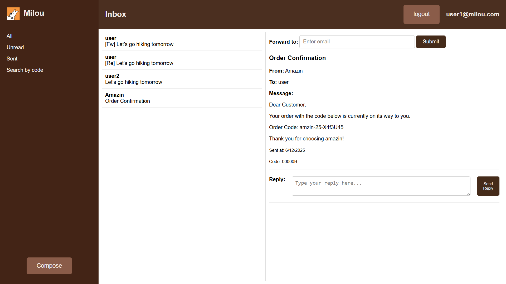
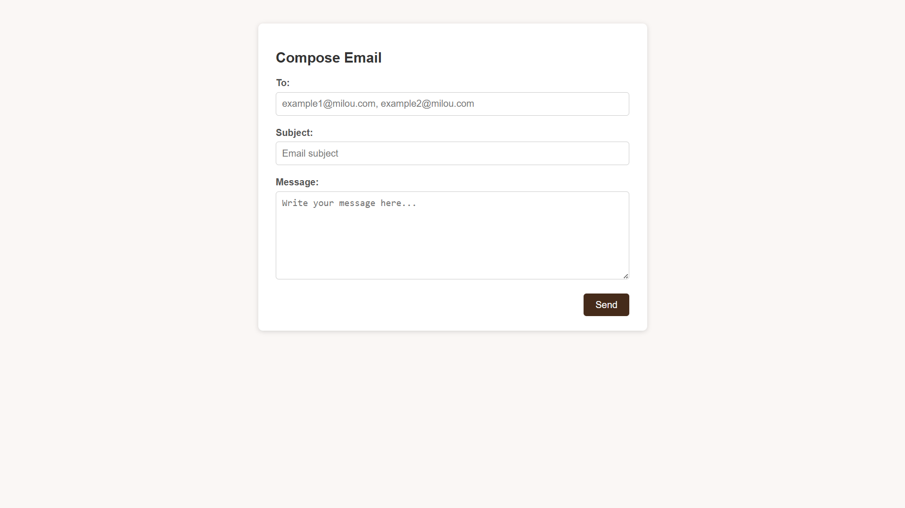
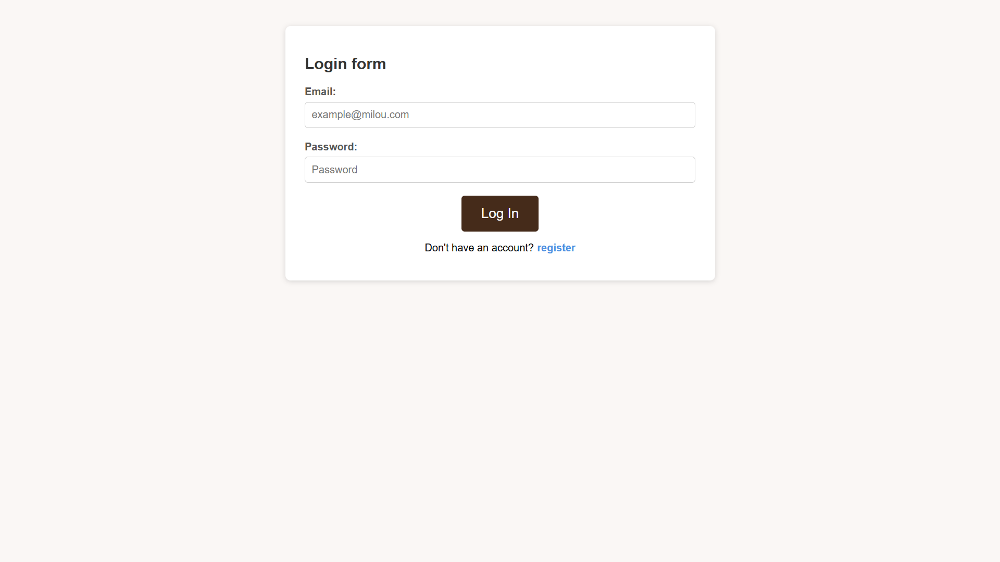
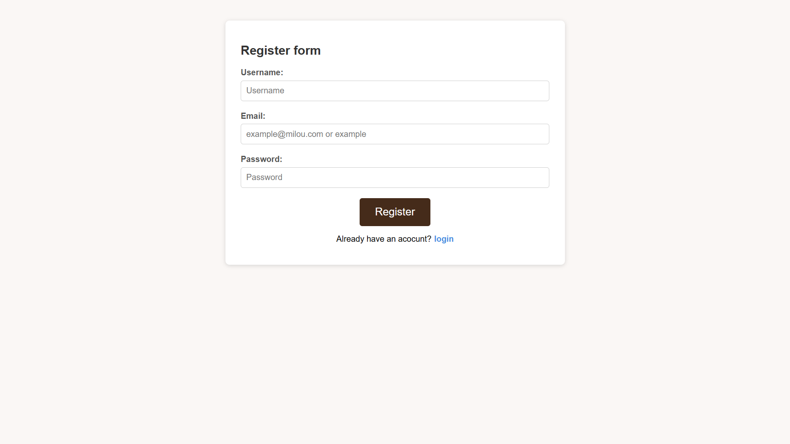

# Milou Email

Milou Email is a web-based email platform that allows users to securely register, log in, send, receive, and manage emails through an interface.

## Features

- User Authentication  
  - Register new accounts  
  - Secure login/logout

- Inbox Management  
  - Email previews listed in a preview panel  
  - Read full email content by clicking on a preview

- Sidebar Navigation  
  - Filter emails by:  
    - All  
    - Unread  
    - Sent  
  - Search for emails by their code title

- Email Viewing & Interaction  
  - View emails in a reading section  
  - Reply to emails  
  - Forward emails to other users

- Compose Emails  
  - `/compose` page to write and send new emails

## Tech Stack

- **Frontend:** HTML, CSS, JavaScript  
- **Backend:** Java (Spring Boot)  
- **Database:** MySQL (using Hibernate ORM for Java integration)  

## Pages

| Route        | Description                              |
|--------------|------------------------------------------|
| `/login`     | Login page for existing users            |
| `/register`  | Sign up page for new users               |
| `/`          | Email dashboard with preview and reading pane |
| `/compose`   | Compose a new email                      |

## Screenshots
`/` (Inbox)

`/compose` (Compose)

`/login` (Login)

`/register` (Register)

